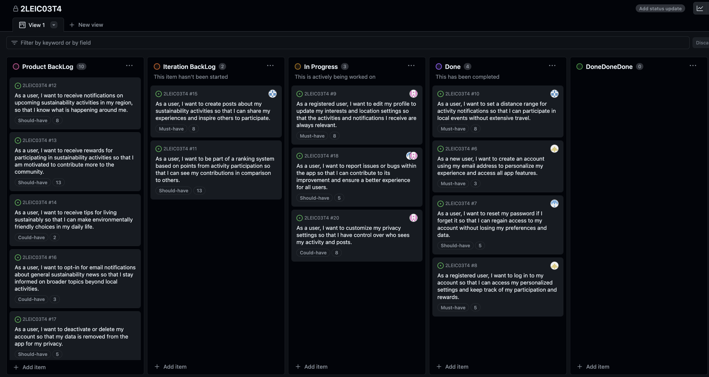

# EcoMobilize Development Report

Here, you can discover the insight of our product, spanning from its general vision to some of the implementation details. This serves as a Software Development Report, organized by activities:

* [Business Modelling](#business-modelling)
    * [Product Vision](#Product-Vision)
    * [Features](#Features)
* [Requirements](#Requirements)
  * [Domain model](#Domain-model)
* [Architecture and Design](#Architecture-And-Design)
  * [Logical architecture](#Logical-Architecture)
  * [Physical architecture](#Physical-Architecture)
  * [Vertical prototype](#Vertical-Prototype)

2LEIC03T4\
Gonçalo Matias up202108703 \
José Lopes up202208288 \
Mário Araújo up202208374\
Mariana Pereira up202207545\
Rodrigo Resende up202108750

---

## Business Modelling

### Product Vision

The application aims to encourage the public to engage in environmentally beneficial activities that contribute to sustainability by facilitating the sharing of activities undertaken or planned by users. Consequently, through the sharing of these activities within the application, each user will obtain a ranking based on points relative to the quantity of events in which they have participated.

### Features

- Show sustainability activities in the user's region.
- Filter the available activities by type, date, location and other criteria.
- Visualize photos and videos of the activities.
- Notifications about new activities that fit into the user's interests.
- Personalize notifications by type of activity, date, location and other criteria.
- Give users rewards for engaging in activities.
- Ranking of points for the users.
- Rewards and motivation for the users with more points.
- Interconnect users to discuss about sustainability.
- Give advice to live in a more sustainable way. 

## Requirements

### Domain Model

This domain model gives us the relationships between users, posts, notifications, news  and areas of interest of the application.
Each user can create a post and subscribe to posts from other users to participate in the activities mentioned. The presence of a particular user in the subscribed activity is confirmed  by the author of the post. This is represented through the "participated" relationship. Each user also has the option to simply like a post and establish a friendship relation with another user.
Posts are associated with up to four areas of interest to make it easier for each user to find the activities that interest them the most. Each user defines, at most, four areas of interest in their profile, which will be used in the activity filtering process.
Users have the ability to share news they have found interesting, always related to the purpose of the application. These shares can be viewed on the user profile.
Notifications will also be shown to users regarding activities that will take place.

## Architecture and Design

### Logical Architeture

* Our app's logical architecture consists of layers for user interface, app management logic, external services, and databases access. The user interface layer handles user interactions, while the app management logic provides core functionalities like ranking, post, user, and activity management. External services enhance our app's capabilities.

### Physical Architeture

* Our system's physical architecture comprises three main components: the Smartphone, the AppServer, and the GoogleServer. The smartphone hosts the Flutter app with a local SQL database for offline data storage. The AppServer hosts the application logic and database using Dart language and a NoSQL database, while the GoogleServer provides GPS Services API for location-related functionalities. This architecture enables efficient communication between the user's device, the application server, and external services for a seamless user experience.

### Vertical Prototype
 * The Vertical Prototypes shows both usages of Firebase and Google Maps API's.
 

## Sprint 1

### Sumary
 - During this sprint we managed to implement some of the planned user stories, however, as some turned out to be more complex than initially anticipated, we were not able to implement everything. 
Others were practically implemented, all that remains is to add the page-switching logic. Now that we know what went wrong in sprint 1, we want to improve and avoid making the same mistakes.

### Implemented Functionalities
- 
- 
- 
- 
-  -> Not fully implemented
-  -> Not fully implemented

### Current progress
