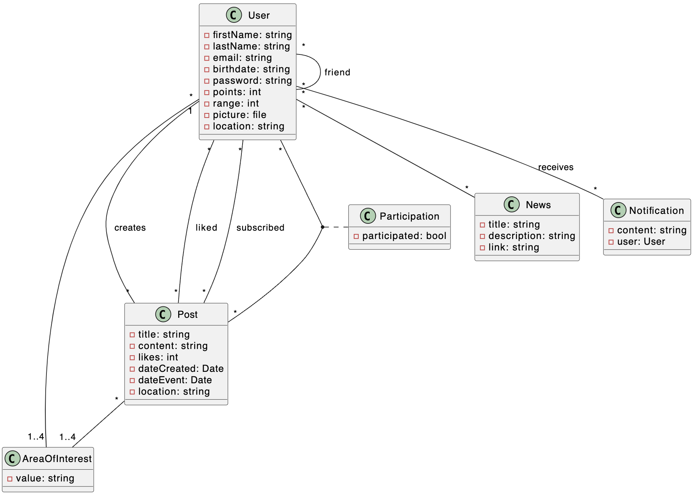

# \<name of the app> Development Report

Here, you can discover the insight of our product, spanning from its general vision to some of the implementation details. This serves as a Software Development Report, organized by activities:

* [Business Modelling](#business-modelling)
    * [Product Vision](#Product-Vision)
    * [Features](#Features)
* [Requirements](#Requirements)
  * [Domain model](#Domain-model)
* [Architecture and Design](#Architecture-And-Design)
  * [Logical architecture](#Logical-Architecture)
  * [Physical architecture](#Physical-Architecture)
  * [Vertical prototype](#Vertical-Prototype)

2LEIC03T4\
Gonçalo Matias up202108703 \
José Lopes up202208288 \
Mário Araújo up202208374\
Mariana Pereira up202207545\
Rodrigo Resende up202108750

---

## Business Modelling

### Product Vision

The application aims to encourage the public to engage in environmentally beneficial activities that contribute to sustainability by facilitating the sharing of activities undertaken or planned by users. Consequently, through the sharing of these activities within the application, each user will obtain a ranking based on points relative to the quantity of events in which they have participated.

### Features

- Show sustainability activities in the user's region.
- Filter the available activities by type, date, location and other criteria.
- Visualize photos and videos of the activities.
- Notifications about new activities that fit into the user's interests.
- Personalize notifications by type of activity, date, location and other criteria.
- Give users rewards for engaging in activities.
- Ranking of points for the users.
- Rewards and motivation for the users with more points.
- Interconnect users to discuss about sustainability.
- Give advice to live in a more sustainable way. 

## Requirements

### Domain Model

This domain model gives us the relationships between users, posts, notifications and areas of interest of the application.
Each user can create a post and subscribe to posts from other users to demonstrate interest in participating in the activities mentioned. The presence of a particular user in the subscribed activity is subsequently recorded by the author of the post. This is represented through the "participated" relationship. Each user also has the option to simply like a post.
Posts are associated with up to four areas of interest to make it easier for each user to find the activities that interest them the most. To enable this filtering, each user can also define four areas of interest in their profile.
Users have the ability to share news they have found interesting, always related to the purpose of the application. These shares can be viewed on a specific page.
Notifications will also be shown to users regarding activities that will take place.

## Architecture and Design

### Logical Architeture

* Text descriptions

### Physical Architeture

* Text descriptions

### Vertical Prototype
